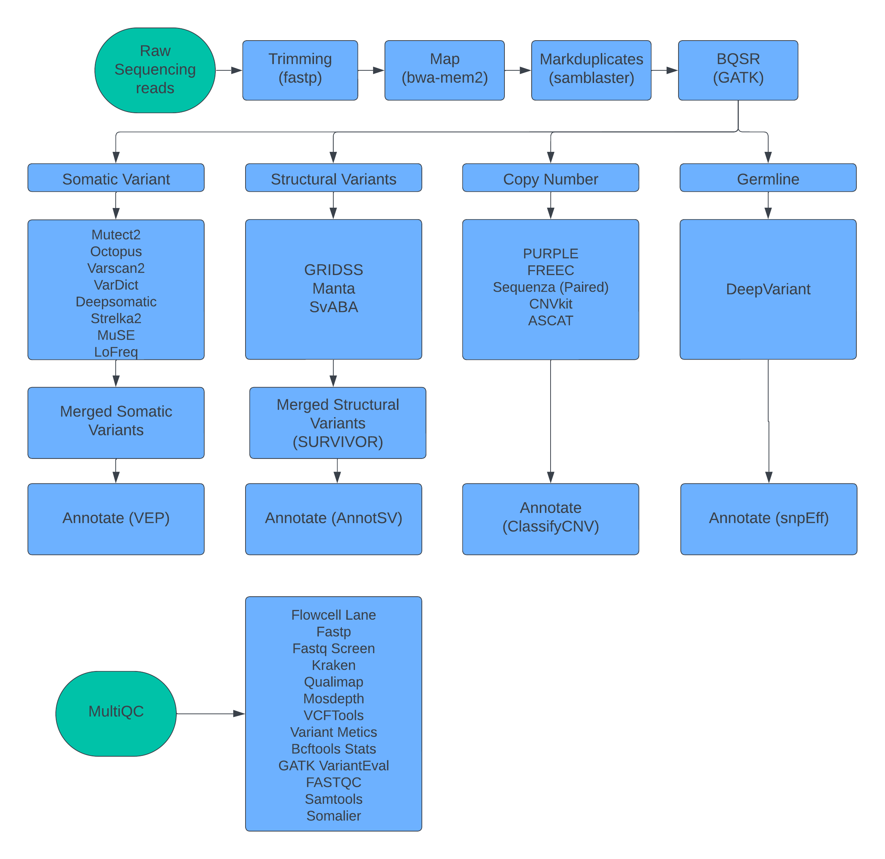

# LOGAN 🔬 

**_whoLe genOme-sequencinG Analysis pipeliNe_**

[](https://github.com/abcsFrederick/LOGAN/actions/workflows/build.yml)
[](https://hub.docker.com/r/nciccbr/ccbr_wes_base)
[](https://github.com/ccbr/LOGAN/issues)
[](https://github.com/ccbr/LOGAN/blob/master/LICENSE)
[](https://github.com/ccbr/LOGAN/releases/latest)

Call germline and somatic variants, CNVs, and SVs and annotate variants!

## Overview

Welcome to LOGAN! Before getting started, we highly recommend reading through [LOGAN's documentation](https://ccbr.github.io/LOGAN).

LOGAN is a comprehensive whole genome-sequencing pipeline following the Broad's set of best practices. It relies on technologies like [Singularity<sup>1</sup>](https://singularity.lbl.gov/) to maintain the highest-level of reproducibility. The pipeline consists of a series of data processing and quality-control steps orchestrated by [Nextflow<sup>2</sup>](https://nextflow.io/), a flexible and scalable workflow management system, to submit jobs to a cluster or cloud provider.

Before getting started, we highly recommend reading through the [usage](https://ccbr.github.io/LOGAN/usage/run/) section of each available sub command.

For more information about issues or trouble-shooting a problem, please checkout our [FAQ](faq/questions.md) prior to [opening an issue on Github](https://github.com/ccbr/LOGAN/issues).

Original pipelining and code forked from the CCBR Exome-seek Pipeline [Exome-seek](https://github.com/CCBR/XAVIER) and [OpenOmics](https://github.com/openOmics/genome-seek)

## Dependencies
**Requires:** `singularity>=3.5`  `nextflow>=22.10.2`

[singularity](https://singularity.lbl.gov/all-releases) must be installed on the target system. Snakemake orchestrates the execution of each step in the pipeline. To guarantee the highest level of reproducibility, each step relies on versioned images from [DockerHub](https://hub.docker.com/orgs/nciccbr/repositories). Nextflow uses singularity to pull these images onto the local filesystem prior to job execution, and as so, nextflow and singularity are the only two dependencies.

## Setup
LOGAN can be used with the Nextflow pipelining software in 
Please clone this repository to your local filesystem using the following command on Biowulf:

```bash
# start an interactive node
sinteractive --mem=2g --cpus-per-task=2 --gres=lscratch:200

git clone https://github.com/CCBR/LOGAN
module load nextflow
##Example run 
nextflow run LOGAN/main.nf -profile ci_stub -preview
```

## Usage

### Input Files
LOGAN supports inputs of either 
1) paired end fastq files

`--fastq_input`- A glob can be used to include all FASTQ files. Like `--fastq_input "*R{1,2}.fastq.gz"`. Globbing requires quotes.

2) Pre aligned BAM files with BAI indices 

`--bam_input`- A glob can be used to include all FASTQ files. Like `--bam_input "*.bam"`. Globbing requires quotes.

3) A sheet that indicates the sample name and either FASTQs or BAM file locations

`--fastq_file_input`-  A headerless tab delimited sheet that has the sample name, R1, and R2 file locations

Example
```bash
c130863309_TUMOR   /data/nousomedr/c130863309_TUMOR.R1_001.fastq.gz  /data/nousomedr/c130863309_TUMOR.R2_001.fastq.gz
c130889189_PBMC  /data/nousomedr/c130889189_PBMC.R1_001.fastq.gz  /data/nousomedr/c130889189_PBMC.R2_001.fastq.gz
```


`--bam_file_input` -  A headerless tab delimited sheet that has the sample name, bam, and bam index (bai) file locations

Example
```bash
c130863309_TUMOR   /data/nousomedr/c130863309_TUMOR.bam  /data/nousomedr/c130863309_TUMOR.bam.bai
c130889189_PBMC  /data/nousomedr/c130889189_PBMC.bam  /data/nousomedr/c130889189_PBMC.bam.bai
```

### Genome
`--genome` - A flag to indicate which genome to run. hg38, hg19 and mm10 are supported.  
Example: `--genome hg38` to run the hg38 genome

`--genome hg19` and `--genome mm10` are also supported 

#### hg38 has options for either  
`--genome hg38` - Based off the GRCh38.d1.vd1.fa which is consistent with TCGA/GDC processing pipelines  

`--genome hg38_sf` - Based off the Homo_sapiens_assembly38.fasta which is derived from the Broad Institute/NCI Sequencing Facility
The biggest difference between the two is that GRCh38.d1.vd1.fa only the GCA_000001405.15_GRCh38_no_alt_analysis_set, Sequence Decoys (GenBank Accession GCA_000786075), and Virus Sequences. Homo_sapiens_assembly38.fasta has HLA specific contigs which may not be compatible with certain downstream tools.


### Operating Modes

#### 1.  Paired Tumor/Normal Mode 

Required for Paired Tumor/Normal Mode

`--sample_sheet` In Paired mode a sample sheet must be provided with the basename of the Tumor and Normal samples. This sheet must be Tab separated with a header for Tumor and Normal.  

Example
```bash
Tumor  Normal
c130863309_TUMOR  c130863309_PBMC
c130889189_TUMOR  c130889189_PBMC
```

#### 2.  Tumor only mode

No addtional flags for sample sheet are required as all samples will be used to call variants

#### Calling Mode

Adding flags determines SNV (germline and/or somatic), SV, and/or CNV calling modes

`--vc` or `--snv` - Enables somatic SNV calling using mutect2, vardict, varscan, octopus, deepsomatic, strelka (TN only), MUSE (TN only), and lofreq (TN only)

`--gl` or `--germline` - Enables germline calling using Deepvariant

`--sv` or `--structural`- Enables somatic SV calling using Manta, GRIDSS, and SVABA

`--cnv` or `--copynumber`- Enables somatic CNV calling using FREEC, Sequenza, ASCAT, CNVKit, and Purple (hg19/hg38 only)


#### Optional Arguments
`--callers` - Comma separated argument for selecting only specified callers, the default is to use all.
Example: `--callers mutect2,octopus`

`--cnvcallers` - Comma separated argument for selecting only specified CNV callers, the default is to use all.
Example: `--cnvcallers purple`

`--svcallers` - Comma separated argument for selecting only specified SV callers, the default is to use all.
Example: `--svcallers gridss`

`--ffpe` - Adds additional filtering for FFPE by detecting strand orientation bias using SOBDetector. 

`--intervals` - Limits calling to intervals provided in target bed file (target bed should have three columns of chr, start, and end)

`--exome` - When using exome data, this flag limits calling to intervals provided in target bed to reduce time and to account for exome sequencing specific parameters.

`--indelrealign` - Enables indel realignment using the GATK pipeline when running alignment steps. May be helpful for certain callers (VarScan, VarDict) that do not have local haplotype reassembly.

## Running LOGAN
Example of Tumor_Normal calling mode 
```bash
# preview the logan jobs that will run 
nextflow run LOGAN/main.nf --mode local -profile ci_stub --genome hg38 --sample_sheet samplesheet.tsv --outdir out --fastq_input "*R{1,2}.fastq.gz" -preview --vc --sv --cnv
# run a stub/dryrun of the logan jobs 
nextflow run LOGAN/main.nf --mode local -profile ci_stub --genome hg38 --sample_sheet samplesheet.tsv --outdir out --fastq_input "*R{1,2}.fastq.gz" -stub --vc --sv --cnv
# launch a logan run on slurm with the test dataset
nextflow run LOGAN/main.nf --mode slurm -profile biowulf,slurm --genome hg38 --sample_sheet samplesheet.tsv --outdir out --fastq_input "*R{1,2}.fastq.gz" --vc --sv --cnv 
```

Example of Tumor only calling mode 
```bash
# preview the logan jobs that will run 
nextflow run LOGAN/main.nf --mode local -profile ci_stub --genome hg38 --outdir out --fastq_input "*R{1,2}.fastq.gz" --callers octopus,mutect2 -preview --vc --sv --cnv
# run a stub/dryrun of the logan jobs 
nextflow run LOGAN/main.nf --mode local -profile ci_stub --genome hg38 --outdir out --fastq_input "*R{1,2}.fastq.gz" --callers octopus,mutect2 -stub --vc --sv --cnv
# launch a logan run on slurm with the test dataset
nextflow run LOGAN/main.nf --mode slurm -profile biowulf,slurm --genome hg38 --outdir out --fastq_input "*R{1,2}.fastq.gz" --callers octopus,mutect2 --vc --sv --cnv
```


### Pipeline Tools and Overview



## Contribute 
This site is a living document, created for and by members like you. LOGAN is maintained by the members of CCBR and is improved by continous feedback! We encourage you to contribute new content and make improvements to existing content via pull request to our [repository](https://github.com/ccbr/LOGAN/pulls).


## References
This repo was originally generated from the [CCBR Nextflow Template](https://github.com/CCBR/CCBR_NextflowTemplate).

<sup>**1.**  Kurtzer GM, Sochat V, Bauer MW (2017). Singularity: Scientific containers for mobility of compute. PLoS ONE 12(5): e0177459.</sup>  
